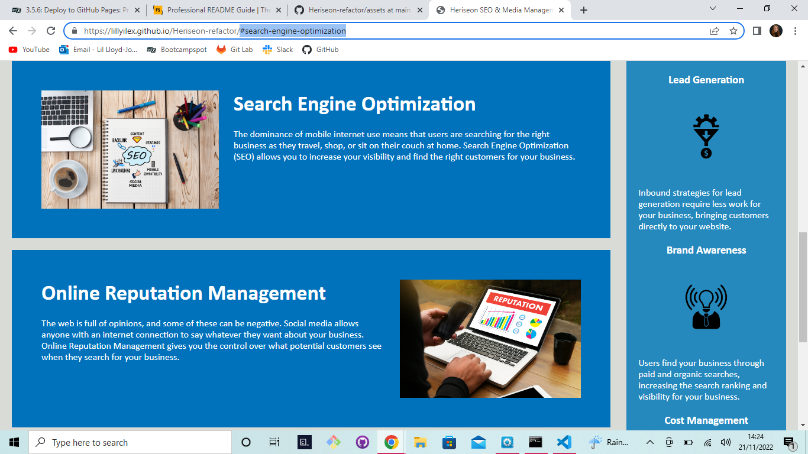

# **Heriseon Website**
Search Engine Optimization and Media Management

## Description

This project is to refactor the existing code to make the website run more smoothly, with multiple bug fixtures improving the overall perfromance of the webpage.

The code should now be more concise, making it easier to read and refactor in the future. Further to this, the the HTML code is more descriptive, due to the use of semantic HTML tags.

### Usage
My aim was to make the website, and it's code, more user friendly; therefore improving the overall experience.
https://lillyilex.github.io/Heriseon-refactor/ will direct you to the landing page of the website. There is a navigation bar in the header for you navigate round the application with ease. 

#### Credits
Pod 2 at Edx Front End Web Dev Bootcamp

##### Licence
N/A
